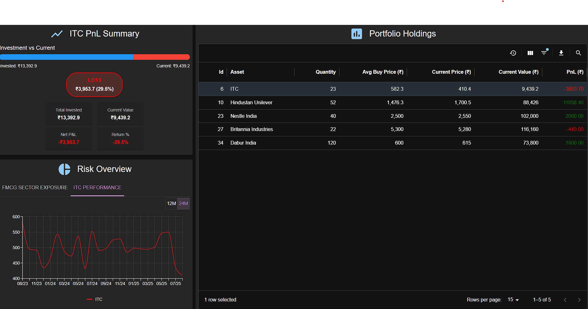

# Vite React Microfrontend(Portfolio Holding)

This project is a React application set up with Vite that supports Module Federation for a microfrontend architecture. It exposes a simple React component that can be used as a microfrontend.

## Project Structure

``` text
portfolio-overview
├──src
│   ├── App.tsx
│   ├── main.tsx
│   ├── vite-env.d.ts
│   ├── components/
│   │   ├── context/
│   │   │   ├── FilterModelContext.tsx
│   │   │   ├── PortfolioContext.tsx
│   │   │   └── ThemeModeContext.tsx
│   │   ├── holdingTable/
│   │   │   ├── HoldingToolbar.tsx
│   │   │   └── PortfolioHoldingTable.tsx
│   │   ├── pnl/
│   │   │   └── PnLSummary.tsx
│   │   ├── risk/
│   │   │   ├── RiskChart.tsx
│   │   │   └── charts/
│   │   │       ├── AssetPieChart.tsx
│   │   │       ├── HistoryPriceLineChart.tsx
│   │   │       └── SectorPieChart.tsx
│   ├── data/
│   |   └── mockData.tsx
├── public
│   └── index.html
├── package.json
├── tsconfig.json
├── vite.config.ts
└── README.md
```

## Setup Instructions

1. **Clone the repository:**

   ```bash
   git clone <repository-url>
   cd portfolio-overview
   ```

2. **Install dependencies:**

   ```bash
   npm install
   ```

3. **Run the application:**

   ```bash
   npm run dev
   ```

4. **Open your browser:**
   Navigate to `http://localhost:3000` to see the application in action.

## Usage


The `App` is a simple React component that has been exposed for use in a microfrontend architecture. You can import and use this component in other applications that support Module Federation.

## Microfrontend Architecture

This project utilizes Module Federation to allow different applications to share components and libraries dynamically. This enables a more modular approach to building applications, where teams can work on different parts of the application independently.

## Dependencies

This project includes stable versions of the following dependencies:

- React
- ReactDOM
- Material UI
- Vite
- Module Federation plugins

## License

This project is licensed under the MIT License.
